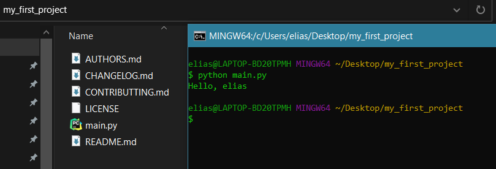

<div align="center">
  
  <h3 align="center">Cookiecutter Template</h3>
  <p align="center">
    Start your <a href="https://github.com/cookiecutter/cookiecutter" target="__blank">cookiecutter</a> templates for generating personalized configurations.
  </p>
  <p align="center">
    <a href="https://github.com/ActivandoIdeas/Cookiecutter-Django-AppEngine-GitLab/blob/master/LICENSE">
      	
    </a>
    <a href="https://www.python.org/">
        
    </a>
  </p>
</div>

# About this cookiecutter

## Features

- Base cookiecutter template
- Simple Python configuration with Cookiecutter Framework
- Generate templates for any framework or language configuration
- Start new projects easy and fast with one command
- Extensible

## Development tools

- Pycharm
- Travis

# Prerequisites

* Python 3.6 or higger https://www.python.org/
* Pip https://pip.pypa.io/en/stable/installing/

Install cookiecutter

```shell
pip install --user cookiecutter
```

# What do you find in this template?

* **cookiecutter.son** (Configuration CLI for your template)
* **hooks** (Automatize taks for generate your template)
* **{{cookiecutter.project_slug}}** (Add your codebase project)

See more info here:

https://github.com/cookiecutter/cookiecutter

## Execute this template

This command generate a simple code structure for hello {your name}

```Bash
cookiecutter https://github.com/ActivandoIdeas/Cookiecutter-Base-Template.git
```

The purpose is that you could know how it works the template structure

You will see something like this:

<div align="center">
    
</div>

## How to use

* Clone this repository

```
git clone https://github.com/ActivandoIdeas/Cookiecutter-Base-Template.git
```

* Customize generating your template

# License

BSD 3-Clause "New" or "Revised" License
View in https://github.com/ActivandoIdeas/Cookiecutter-Django-AppEngine-GitLab/blob/master/LICENSE

# Contributing

Contributors are always welcome!
Feel free to raise an issue or submit a PR.
Read the code of Conduct here: https://github.com/ActivandoIdeas/Codigo-de-Conducta-y-Guia-Rapida

This project is based on cuokiecutter: 
* Read this for project contribution: 
    * https://raphael.codes/blog/create-your-own-cookiecutter-template/
    * https://cookiecutter.readthedocs.io/en/1.7.2/tutorials.html